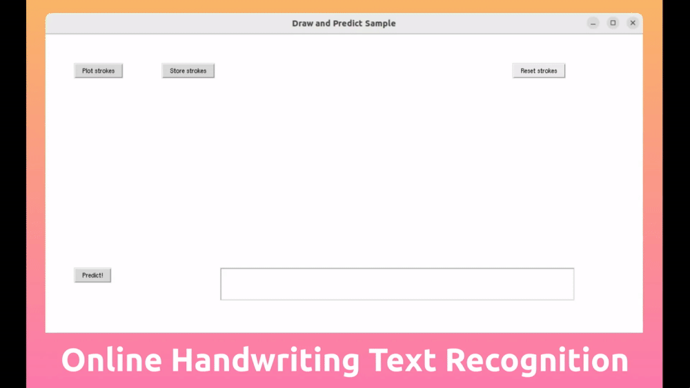

<div align="center">

# Online Handwritten Text Recognition with PyTorch

[](https://github.com/pre-commit/pre-commit)
[](https://pytorch.org/get-started/locally/)
[](https://pytorchlightning.ai/)
[](https://hydra.cc/) <br>
[](https://github.com/ashleve/lightning-hydra-template/pulls)
<a href="https://github.com/ashleve/lightning-hydra-template"></a>
[](#license)

A clean PyTorch implementation of ["Fast multi-language LSTM-based online handwriting recognition"](https://doi.org/10.1007/s10032-020-00350-4) by Carbune *et al.* (2020) 🚀⚡🔥.<br>

_Contributions are always welcome!_

</div>

<br>

## 📌 Introduction

In this repository I provide a [PyTorch](https://pytorch.org/) implementation of the paper "Fast multi-language [LSTM](https://en.wikipedia.org/wiki/Long_short-term_memory)-based online handwriting recognition" by Victor Carbune *et al.* (see paper here: [10.1007/s10032-020-00350-4](http://doi.org/10.1007/s10032-020-00350-4)), hence the name of this repository.

This work is part of my attempt to build a handwriting recognition system for [Xournal++](https://github.com/xournalpp/xournalpp), a fabulous open-source handwriting notetaking software. Most of this aforementioned attempt is captured in the [Xournal++ HTR](https://github.com/PellelNitram/xournalpp_htr) repository where I publish working solutions.

## TODOs in this repo and README

- [ ] Add badges
- [ ] Add project website in description and here in README. Sth like `http://lellep.xyz/blog/?utm_campaign=github`.

## Project Demo

<div align="center">

<a href="https://youtu.be/H62bjwNkMvc?utm_source=github&utm_medium=readme&utm_campaign=github_readme">
    
</a>

*([Click on GIF or here to get to video](https://youtu.be/H62bjwNkMvc?utm_source=github&utm_medium=readme&utm_campaign=github_readme).)*

</div>

## 📺 Project Video

TODO!

<div align="center">

[](https://www.youtube.com/watch?v=ek1j272iAmc)

*(Click to get to video.)*

</div>

## 🚀 Installation

TODO: Use conda env file to make installation process easier.

The installation process is for now:

1. `conda create --prefix <path> python=3.10.11`
2. `conda activate <path>`
3. `pip3 install torch torchvision torchaudio`
4. `pip install -r requirements.txt`
5. `pip install -e .` (do not forget the dot, `.`)
6. `make test` to confirm that installation was successful

## 🚀 Quickstart

TODO.

- Activate your environment and place training data according to below section
- To do inference on your own writing: `python src/draw_and_predict_sample.py`
- To capture your own handwriting into a file: `python src/draw_and_store_sample.py`
- To train: `python src/train.py`

## Training data

[IAM On-Line Handwriting Database](https://fki.tic.heia-fr.ch/databases/iam-on-line-handwriting-database) is used as training and validation data. Register on their website to obtain the dataset for free. Afterwards, place the following folders and files from their dataset in this repository's subfolder `data/datasets/IAM-OnDB`. This is how it should look like:

```
├── data/datasets/IAM-OnDB
│   ├── ascii-all/
│   ├── forms.txt
│   ├── lineImages-all
│   ├── lineStrokes-all
│   ├── original-xml-all
│   ├── original-xml-part
│   └── writers.xml
```

## 🏋️ Training from scratch

1. Follow installation procedure provided in [Installation](#installation).
2. Download the [IAM-OnDB](https://fki.tic.heia-fr.ch/databases/iam-on-line-handwriting-database) dataset to `{data_dir}/datasets/IAM-OnDB` where `{data_dir}` is defined in the [paths config](configs/paths/default.yaml). This download process is as follows:
   1. Download the following files that are listed on the above stated dataset website: `data/original-xml-part.tar.gz`, `data/writers.xml`, `data/lineStrokes-all.tar.gz`, `data/lineImages-all.tar.gz`, `data/original-xml-all.tar.gz`, `data/forms.txt` & `ascii-all.tar.gz`.
   2. Extract the content of each of those files into the `{data_dir}/datasets/IAM-OnDB/<file_base_name>` folder where `<file_base_name>` denote the basenames of all downloaded files.

## Available models & model cards - TODO

- [x] `featuresRaw_decoderGreedy_...`
  - TODO: describe how it's trained
  - TODO: download here (link to blog article w/ bitly)
  - TODO: replicate this in `scripts/`

## Goals / Features TODO

- [x] Allow inference on own handwriting.

## ⌛ Open tasks

*All contributions are welcome! :-)*

- [ ] Implement Bezier curve fitting algorithm as data preprocessor.
- [ ] Publish trained models on [🤗 Hugging Face](https://huggingface.co/) for easy access.

## 🙏🏼 Contributing

I would love you to contribute! Let's make it a great project that people can benefit from :-).

## Acknowledgments

*(TODO)*.

[Harald Scheidl](https://githubharald.github.io/) for providing both great content and code around handwritten text recognition.

I thank the department where I do my PhD, the [School of Physics and Astronomy](https://www.ph.ed.ac.uk/) of [The University of Edinburgh](https://www.ed.ac.uk/), for providing computational resources to train the models.

The scaffold of this code is based on [the awesome lightning-hydra-template](https://github.com/ashleve/lightning-hydra-template) by [ashleve](https://github.com/ashleve) - thank you for providing this!

## License

This repository is licensed under the [MIT License](LICENSE.md).

<div align="center">

---

TODO: Tidy up the below.

# Lightning-Hydra-Template

[](https://github.com/pre-commit/pre-commit)
[](https://pytorch.org/get-started/locally/)
[](https://pytorchlightning.ai/)
[](https://hydra.cc/)
[](https://black.readthedocs.io/en/stable/)
[](https://pycqa.github.io/isort/) <br>
[](https://github.com/ashleve/lightning-hydra-template/actions/workflows/test.yml)
[](https://github.com/ashleve/lightning-hydra-template/actions/workflows/code-quality-main.yaml)
[](https://codecov.io/gh/ashleve/lightning-hydra-template) <br>
[](https://github.com/ashleve/lightning-hydra-template#license)
[](https://github.com/ashleve/lightning-hydra-template/pulls)
[](https://github.com/ashleve/lightning-hydra-template/graphs/contributors)

A clean template to kickstart your deep learning project 🚀⚡🔥<br>
Click on [<kbd>Use this template</kbd>](https://github.com/ashleve/lightning-hydra-template/generate) to initialize new repository.

_Suggestions are always welcome!_

</div>

<br>

## Main Ideas

- [**Rapid Experimentation**](#your-superpowers): thanks to hydra command line superpowers
- [**Minimal Boilerplate**](#how-it-works): thanks to automating pipelines with config instantiation
- [**Main Configs**](#main-config): allow you to specify default training configuration
- [**Experiment Configs**](#experiment-config): allow you to override chosen hyperparameters and version control experiments
- [**Workflow**](#workflow): comes down to 4 simple steps
- [**Experiment Tracking**](#experiment-tracking): Tensorboard, W&B, Neptune, Comet, MLFlow and CSVLogger
- [**Logs**](#logs): all logs (checkpoints, configs, etc.) are stored in a dynamically generated folder structure
- [**Hyperparameter Search**](#hyperparameter-search): simple search is effortless with Hydra plugins like Optuna Sweeper
- [**Tests**](#tests): generic, easy-to-adapt smoke tests for speeding up the development
- [**Continuous Integration**](#continuous-integration): automatically test and lint your repo with Github Actions
- [**Best Practices**](#best-practices): a couple of recommended tools, practices and standards

## Experiment Tracking

PyTorch Lightning supports many popular logging frameworks: [Weights&Biases](https://www.wandb.com/), [Neptune](https://neptune.ai/), [Comet](https://www.comet.ml/), [MLFlow](https://mlflow.org), [Tensorboard](https://www.tensorflow.org/tensorboard/).

These tools help you keep track of hyperparameters and output metrics and allow you to compare and visualize results. To use one of them simply complete its configuration in [configs/logger](configs/logger) and run:

```bash
python train.py logger=logger_name
```

You can use many of them at once (see [configs/logger/many_loggers.yaml](configs/logger/many_loggers.yaml) for example).

You can also write your own logger.

Lightning provides convenient method for logging custom metrics from inside LightningModule. Read the [docs](https://pytorch-lightning.readthedocs.io/en/latest/extensions/logging.html#automatic-logging) or take a look at [MNIST example](src/models/mnist_module.py).

<br>

## Tests

Template comes with generic tests implemented with `pytest`.

```bash
# run all tests
pytest

# run tests from specific file
pytest tests/test_train.py

# run all tests except the ones marked as slow
pytest -k "not slow"
```

Most of the implemented tests don't check for any specific output - they exist to simply verify that executing some commands doesn't end up in throwing exceptions. You can execute them once in a while to speed up the development.

Currently, the tests cover cases like:

- running 1 train, val and test step
- running 1 epoch on 1% of data, saving ckpt and resuming for the second epoch
- running 2 epochs on 1% of data, with DDP simulated on CPU

And many others. You should be able to modify them easily for your use case.

There is also `@RunIf` decorator implemented, that allows you to run tests only if certain conditions are met, e.g. GPU is available or system is not windows. See the [examples](tests/test_train.py).

<br>

## Hyperparameter Search

You can define hyperparameter search by adding new config file to [configs/hparams_search](configs/hparams_search).

<details>
<summary><b>Show example hyperparameter search config</b></summary>

```yaml
# @package _global_

defaults:
  - override /hydra/sweeper: optuna

# choose metric which will be optimized by Optuna
# make sure this is the correct name of some metric logged in lightning module!
optimized_metric: "val/acc_best"

# here we define Optuna hyperparameter search
# it optimizes for value returned from function with @hydra.main decorator
hydra:
  sweeper:
    _target_: hydra_plugins.hydra_optuna_sweeper.optuna_sweeper.OptunaSweeper

    # 'minimize' or 'maximize' the objective
    direction: maximize

    # total number of runs that will be executed
    n_trials: 20

    # choose Optuna hyperparameter sampler
    # docs: https://optuna.readthedocs.io/en/stable/reference/samplers.html
    sampler:
      _target_: optuna.samplers.TPESampler
      seed: 1234
      n_startup_trials: 10 # number of random sampling runs before optimization starts

    # define hyperparameter search space
    params:
      model.optimizer.lr: interval(0.0001, 0.1)
      data.batch_size: choice(32, 64, 128, 256)
      model.net.lin1_size: choice(64, 128, 256)
      model.net.lin2_size: choice(64, 128, 256)
      model.net.lin3_size: choice(32, 64, 128, 256)
```

</details>

Next, execute it with: `python train.py -m hparams_search=mnist_optuna`

Using this approach doesn't require adding any boilerplate to code, everything is defined in a single config file. The only necessary thing is to return the optimized metric value from the launch file.

You can use different optimization frameworks integrated with Hydra, like [Optuna, Ax or Nevergrad](https://hydra.cc/docs/plugins/optuna_sweeper/).

The `optimization_results.yaml` will be available under `logs/task_name/multirun` folder.

This approach doesn't support resuming interrupted search and advanced techniques like prunning - for more sophisticated search and workflows, you should probably write a dedicated optimization task (without multirun feature).

<br>

## Continuous Integration

Template comes with CI workflows implemented in Github Actions:

- `.github/workflows/test.yaml`: running all tests with pytest
- `.github/workflows/code-quality-main.yaml`: running pre-commits on main branch for all files
- `.github/workflows/code-quality-pr.yaml`: running pre-commits on pull requests for modified files only

<br>

## Distributed Training

Lightning supports multiple ways of doing distributed training. The most common one is DDP, which spawns separate process for each GPU and averages gradients between them. To learn about other approaches read the [lightning docs](https://lightning.ai/docs/pytorch/latest/advanced/speed.html).

You can run DDP on mnist example with 4 GPUs like this:

```bash
python train.py trainer=ddp
```

> **Note**: When using DDP you have to be careful how you write your models - read the [docs](https://lightning.ai/docs/pytorch/latest/advanced/speed.html).

<br>

## Accessing Datamodule Attributes In Model

The simplest way is to pass datamodule attribute directly to model on initialization:

```python
# ./src/train.py
datamodule = hydra.utils.instantiate(config.data)
model = hydra.utils.instantiate(config.model, some_param=datamodule.some_param)
```

> **Note**: Not a very robust solution, since it assumes all your datamodules have `some_param` attribute available.

Similarly, you can pass a whole datamodule config as an init parameter:

```python
# ./src/train.py
model = hydra.utils.instantiate(config.model, dm_conf=config.data, _recursive_=False)
```

You can also pass a datamodule config parameter to your model through variable interpolation:

```yaml
# ./configs/model/my_model.yaml
_target_: src.models.my_module.MyLitModule
lr: 0.01
some_param: ${data.some_param}
```

Another approach is to access datamodule in LightningModule directly through Trainer:

```python
# ./src/models/mnist_module.py
def on_train_start(self):
  self.some_param = self.trainer.datamodule.some_param
```

> **Note**: This only works after the training starts since otherwise trainer won't be yet available in LightningModule.

<br>

## Best Practices

<details>
<summary><b>Use Miniconda</b></summary>

It's usually unnecessary to install full anaconda environment, miniconda should be enough (weights around 80MB).

Big advantage of conda is that it allows for installing packages without requiring certain compilers or libraries to be available in the system (since it installs precompiled binaries), so it often makes it easier to install some dependencies e.g. cudatoolkit for GPU support.

It also allows you to access your environments globally which might be more convenient than creating new local environment for every project.

Example installation:

```bash
wget https://repo.anaconda.com/miniconda/Miniconda3-latest-Linux-x86_64.sh
bash Miniconda3-latest-Linux-x86_64.sh
```

Update conda:

```bash
conda update -n base -c defaults conda
```

Create new conda environment:

```bash
conda create -n myenv python=3.10
conda activate myenv
```

</details>

<details>
<summary><b>Use automatic code formatting</b></summary>

Use pre-commit hooks to standardize code formatting of your project and save mental energy.<br>
Simply install pre-commit package with:

```bash
pip install pre-commit
```

Next, install hooks from [.pre-commit-config.yaml](.pre-commit-config.yaml):

```bash
pre-commit install
```

After that your code will be automatically reformatted on every new commit.

To reformat all files in the project use command:

```bash
pre-commit run -a
```

To update hook versions in [.pre-commit-config.yaml](.pre-commit-config.yaml) use:

```bash
pre-commit autoupdate
```

</details>

<details>
<summary><b>Set private environment variables in .env file</b></summary>

System specific variables (e.g. absolute paths to datasets) should not be under version control or it will result in conflict between different users. Your private keys also shouldn't be versioned since you don't want them to be leaked.<br>

Template contains `.env.example` file, which serves as an example. Create a new file called `.env` (this name is excluded from version control in .gitignore).
You should use it for storing environment variables like this:

```
MY_VAR=/home/user/my_system_path
```

All variables from `.env` are loaded in `train.py` automatically.

Hydra allows you to reference any env variable in `.yaml` configs like this:

```yaml
path_to_data: ${oc.env:MY_VAR}
```

</details>

<details>
<summary><b>Name metrics using '/' character</b></summary>

Depending on which logger you're using, it's often useful to define metric name with `/` character:

```python
self.log("train/loss", loss)
```

This way loggers will treat your metrics as belonging to different sections, which helps to get them organised in UI.

</details>

<details>
<summary><b>Use torchmetrics</b></summary>

Use official [torchmetrics](https://github.com/PytorchLightning/metrics) library to ensure proper calculation of metrics. This is especially important for multi-GPU training!

For example, instead of calculating accuracy by yourself, you should use the provided `Accuracy` class like this:

```python
from torchmetrics.classification.accuracy import Accuracy


class LitModel(LightningModule):
    def __init__(self)
        self.train_acc = Accuracy()
        self.val_acc = Accuracy()

    def training_step(self, batch, batch_idx):
        ...
        acc = self.train_acc(predictions, targets)
        self.log("train/acc", acc)
        ...

    def validation_step(self, batch, batch_idx):
        ...
        acc = self.val_acc(predictions, targets)
        self.log("val/acc", acc)
        ...
```

Make sure to use different metric instance for each step to ensure proper value reduction over all GPU processes.

Torchmetrics provides metrics for most use cases, like F1 score or confusion matrix. Read [documentation](https://torchmetrics.readthedocs.io/en/latest/#more-reading) for more.

</details>

<details>
<summary><b>Follow PyTorch Lightning style guide</b></summary>

The style guide is available [here](https://pytorch-lightning.readthedocs.io/en/latest/starter/style_guide.html).<br>

1. Be explicit in your init. Try to define all the relevant defaults so that the user doesn’t have to guess. Provide type hints. This way your module is reusable across projects!

   ```python
   class LitModel(LightningModule):
       def __init__(self, layer_size: int = 256, lr: float = 0.001):
   ```

2. Preserve the recommended method order.

   ```python
   class LitModel(LightningModule):

       def __init__():
           ...

       def forward():
           ...

       def training_step():
           ...

       def training_step_end():
           ...

       def on_train_epoch_end():
           ...

       def validation_step():
           ...

       def validation_step_end():
           ...

       def on_validation_epoch_end():
           ...

       def test_step():
           ...

       def test_step_end():
           ...

       def on_test_epoch_end():
           ...

       def configure_optimizers():
           ...

       def any_extra_hook():
           ...
   ```

</details>

<details>
<summary><b>Version control your data and models with DVC</b></summary>

Use [DVC](https://dvc.org) to version control big files, like your data or trained ML models.<br>
To initialize the dvc repository:

```bash
dvc init
```

To start tracking a file or directory, use `dvc add`:

```bash
dvc add data/MNIST
```

DVC stores information about the added file (or a directory) in a special .dvc file named data/MNIST.dvc, a small text file with a human-readable format. This file can be easily versioned like source code with Git, as a placeholder for the original data:

```bash
git add data/MNIST.dvc data/.gitignore
git commit -m "Add raw data"
```

</details>

<details>
<summary><b>Support installing project as a package</b></summary>

It allows other people to easily use your modules in their own projects.
Change name of the `src` folder to your project name and complete the `setup.py` file.

Now your project can be installed from local files:

```bash
pip install -e .
```

Or directly from git repository:

```bash
pip install git+git://github.com/YourGithubName/your-repo-name.git --upgrade
```

So any file can be easily imported into any other file like so:

```python
from project_name.models.mnist_module import MNISTLitModule
from project_name.data.mnist_datamodule import MNISTDataModule
```

</details>

<details>
<summary><b>Keep local configs out of code versioning</b></summary>

Some configurations are user/machine/installation specific (e.g. configuration of local cluster, or harddrive paths on a specific machine). For such scenarios, a file [configs/local/default.yaml](configs/local/) can be created which is automatically loaded but not tracked by Git.

For example, you can use it for a SLURM cluster config:

```yaml
# @package _global_

defaults:
  - override /hydra/launcher@_here_: submitit_slurm

data_dir: /mnt/scratch/data/

hydra:
  launcher:
    timeout_min: 1440
    gpus_per_task: 1
    gres: gpu:1
  job:
    env_set:
      MY_VAR: /home/user/my/system/path
      MY_KEY: asdgjhawi8y23ihsghsueity23ihwd
```

</details>

<br>

## Resources

This template was inspired by:

- [PyTorchLightning/deep-learning-project-template](https://github.com/PyTorchLightning/deep-learning-project-template)
- [drivendata/cookiecutter-data-science](https://github.com/drivendata/cookiecutter-data-science)
- [lucmos/nn-template](https://github.com/lucmos/nn-template)

Other useful repositories:

- [jxpress/lightning-hydra-template-vertex-ai](https://github.com/jxpress/lightning-hydra-template-vertex-ai) - lightning-hydra-template integration with Vertex AI hyperparameter tuning and custom training job

</details>

<br>

## License

Lightning-Hydra-Template is licensed under the MIT License.

```
MIT License

Copyright (c) 2021 ashleve

Permission is hereby granted, free of charge, to any person obtaining a copy
of this software and associated documentation files (the "Software"), to deal
in the Software without restriction, including without limitation the rights
to use, copy, modify, merge, publish, distribute, sublicense, and/or sell
copies of the Software, and to permit persons to whom the Software is
furnished to do so, subject to the following conditions:

The above copyright notice and this permission notice shall be included in all
copies or substantial portions of the Software.

THE SOFTWARE IS PROVIDED "AS IS", WITHOUT WARRANTY OF ANY KIND, EXPRESS OR
IMPLIED, INCLUDING BUT NOT LIMITED TO THE WARRANTIES OF MERCHANTABILITY,
FITNESS FOR A PARTICULAR PURPOSE AND NONINFRINGEMENT. IN NO EVENT SHALL THE
AUTHORS OR COPYRIGHT HOLDERS BE LIABLE FOR ANY CLAIM, DAMAGES OR OTHER
LIABILITY, WHETHER IN AN ACTION OF CONTRACT, TORT OR OTHERWISE, ARISING FROM,
OUT OF OR IN CONNECTION WITH THE SOFTWARE OR THE USE OR OTHER DEALINGS IN THE
SOFTWARE.
```

<br>
<br>
<br>
<br>

**DELETE EVERYTHING ABOVE FOR YOUR PROJECT**

______________________________________________________________________

<div align="center">

# Your Project Name

<a href="https://pytorch.org/get-started/locally/"></a>
<a href="https://pytorchlightning.ai/"></a>
<a href="https://hydra.cc/"></a>
<a href="https://github.com/ashleve/lightning-hydra-template"></a><br>
[](https://www.nature.com/articles/nature14539)
[](https://papers.nips.cc/paper/2020)

</div>

## Description

What it does

## Installation

#### Pip

```bash
# clone project
git clone https://github.com/YourGithubName/your-repo-name
cd your-repo-name

# [OPTIONAL] create conda environment
conda create -n myenv python=3.9
conda activate myenv

# install pytorch according to instructions
# https://pytorch.org/get-started/

# install requirements
pip install -r requirements.txt
```

#### Conda

```bash
# clone project
git clone https://github.com/YourGithubName/your-repo-name
cd your-repo-name

# create conda environment and install dependencies
conda env create -f environment.yaml -n myenv

# activate conda environment
conda activate myenv
```

## How to run

Train model with default configuration

```bash
# train on CPU
python src/train.py trainer=cpu

# train on GPU
python src/train.py trainer=gpu
```

Train model with chosen experiment configuration from [configs/experiment/](configs/experiment/)

```bash
python src/train.py experiment=experiment_name.yaml
```

You can override any parameter from command line like this

```bash
python src/train.py trainer.max_epochs=20 data.batch_size=64
```
